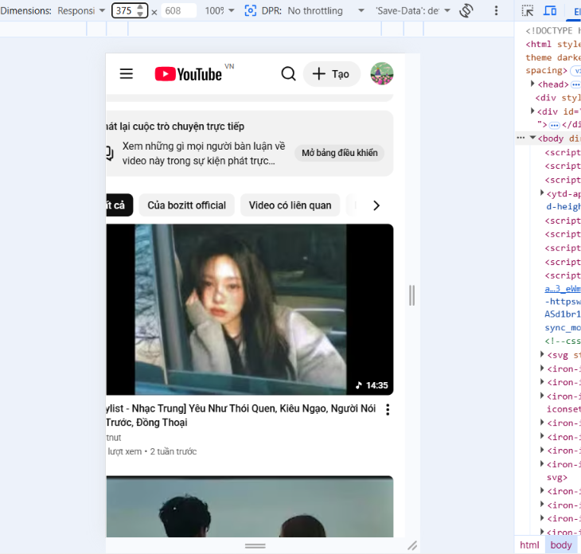
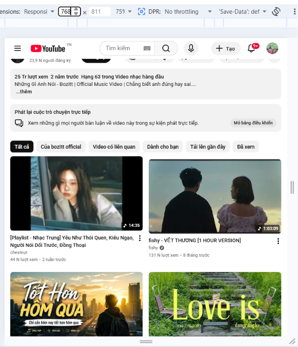
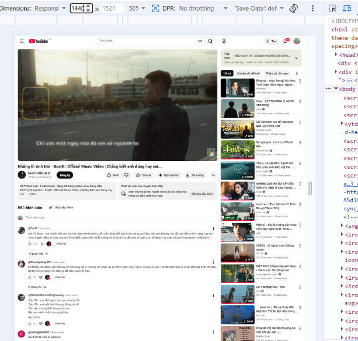
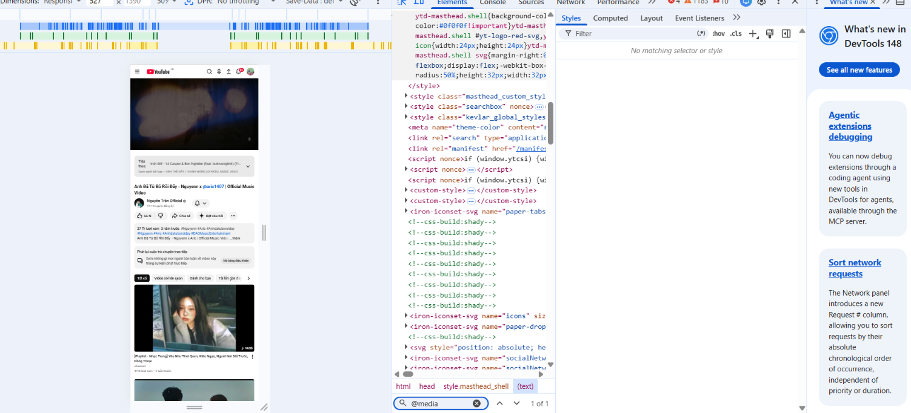

## Câu A1:
1. Thẻ `<meta name="viewport">`chuẩn:
```html
<meta name="viewport" content="width=device-width, initial-scale=1.0">
```
- Giải thích từng thuộc tính: 
    + `name="viewport"`: Báo cho trình duyệt biết các chỉ thị bên trong thẻ này dùng để thiết lập cấu hình khung hiển thị (viewport) của trang web.
    + `width=device-width`: Chiều rộng trang bằng chiều rộng thiết bị.
    + `initial-scale=1.0`: Tỷ lệ zoom ban đầu là 1:1.
- Thiếu thẻ này: iPhone sẽ tự ép viewport về `980px`, giao diện bị thu nhỏ tí hon, bắt người dùng phải zoom và cuộn ngang.
- Khác biệt:
    + Mobile-First: Viết CSS cho mobile trước, dùng `@media (min-width)` để tăng tiến lên màn hình lớn.
    + Desktop-First: Viết CSS cho desktop trước, dùng `@media (max-width)` để bóp nhỏ về màn hình bé.
- Ví Dụ: 
```css
.sidebar { display: none; }
@media (min-width: 768px) { .sidebar { display: block; } }

.sidebar { display: block; }
@media (max-width: 767px) { .sidebar { display: none; } }
```
- Lý do khuyên dùng Mobile-First: Tối ưu hiệu năng cho thiết bị yếu, tải ít CSS hơn, tập trung vào nội dung cốt lõi, hợp xu hướng mobile chiếm đa số.
## Câu A2:
- `xs` (< 576px): Điện thoại dọc -> 1 cột.
- `sm` (>= 576px): Điện thoại ngang -> 2 cột.
- `md` (>= 768px): Máy tính bảng dọc -> 2 hoặc 3 cột.
- `lg` (>= 992px): Laptop nhỏ -> 3 hoặc 4 cột.
- `xl` (>= 1200px): Desktop lớn -> 4 cột.
## Câu A3:
| Chiều rộng màn hình | `.container` width |
| ------------------- | -------------------|
|       375px         |       100%         |
|       600px         |       540px        |
|       800px         |       720px        |
|       1000px        |       960px        |
|       1400px        |      1140px        |
## Câu A4:
- 4 tính năng chính:
    + Variables ($): Lưu giá trị để dùng lại (Ví dụ: `$color: red;`)
    + Nesting: Viết CSS lồng nhau (Ví dụ: `nav { ul { list-style: none; } }`).
    + Mixins: Hàm tái sử dụng CSS (Ví dụ: `@mixin flex { display: flex; }`).
    + @extend: Kế thừa thuộc tính của class khác (Ví dụ: `.btn-buy { @extend .btn-base; }`).
- Lý do trình duyệt không đọc được: Trình duyệt chỉ hiểu CSS chuẩn, không hiểu cú pháp nâng cao của SCSS.
- Bước chuyển đổi: Cần dùng công cụ biên dịch (Compiler) như Live Sass Compiler hoặc Node-sass để biên dịch `.scss` sang `.css`.

## Câu B3:
Lệnh compile: sass --watch scss/style.scss:css/responsive.css

## Câu C1: Shopee
1. 
- Mobile (375px):


- Tablet (768px):


- Desktop (1440px): 


2. Phân tích:
- Navigation: Desktop hiện full menu ngang. Mobile ẩn đi ô nhập tìm kiếm.
- Lưới content: Desktop 3 cột. Tablet 2 cột . Mobile 1 cột dọc.
- Bị ẩn trên Mobile: Ô nhập tìm kiếm.
- Font size: Tiêu đề (H1) tự động co nhỏ (ví dụ từ 32px trên desktop xuống 22px trên mobile).

3. 

## Câu C2:
1. Mobile:
```
┌──────────────────────────────────────┐
│               HEADER                 │
│       [Logo]       [Icon Call]       │
├──────────────────────────────────────┤
│             HERO IMAGE               │
├──────────────────────────────────────┤
│          FORM ĐẶT BÀN (Order 1)      │
│  [Ngày/Giờ] [Số người] [Nút Đặt]     │
├──────────────────────────────────────┤
│         GRID MÓN ĂN (Order 2)        │
│  ┌───────────┐                       │
│  │  Món 1    │                       │
│  └───────────┘                       │
│  │  Món 2    │ (Xếp dọc xuống...     │
│  └───────────┘  đủ 6 món)            │
├──────────────────────────────────────┤
│         GOOGLE MAPS (Order 3)        │
├──────────────────────────────────────┤
│               FOOTER                 │
└──────────────────────────────────────┘
```
2. Tablet:
```
┌──────────────────────────────────────────────────┐
│ HEADER: [Logo]                    [SĐT Đặt Bàn]  │
├──────────────────────────────────────────────────┤
│                   HERO IMAGE                     │
├──────────────────────────────────────────────────┤
│ GRID MÓN ĂN (3 Cột x 2 Hàng)                     │
│ ┌───────────┐  ┌───────────┐  ┌───────────┐      │
│ │  Món 1    │  │  Món 2    │  │  Món 3    │      │
│ └───────────┘  └───────────┘  └───────────┘      │
│ ┌───────────┐  ┌───────────┐  ┌───────────┐      │
│ │  Món 4    │  │  Món 5    │  │  Món 6    │      │
│ └───────────┘  └───────────┘  └───────────┘      │
├─────────────────────────┬────────────────────────┤
│ FORM ĐẶT BÀN (50%)      │ GOOGLE MAPS (50%)      │
│ [Ngày]   [Giờ]          │                        │
│ [Số người] [Ghi chú]    │                        │
│ [Nút Đặt Bàn]           │                        │
├─────────────────────────┴────────────────────────┤
│                     FOOTER                       │
└──────────────────────────────────────────────────┘
```
3.Desktop:
```
┌──────────────────────────────────────────────────────────────────────────────────────┐
│ HEADER: [Logo]                                                          [SĐT Đặt Bàn]│
├──────────────────────────────────────────────────────────────────────────────────────┤
│                                      HERO IMAGE                                      │
├──────────────────────────────────────────────────────────────────────────┬───────────┤
│  Khu vực Main Content (Bên trái)                                         │ Sidebar   │
│                                                                          │ (Bên phải)│
│  GRID MÓN ĂN (6 Cột hàng ngang)                                          │           │
│  ┌──────┐ ┌──────┐ ┌──────┐ ┌──────┐ ┌──────┐ ┌──────┐                   │ ┌───────┐ │
│  │Món 1 │ │Món 2 │ │Món 3 │ │Món 4 │ │Món 5 │ │Món 6 │                   │ │ FORM  │ │
│  └──────┘ └──────┘ └──────┘ └──────┘ └──────┘ └──────┘                   │ │ ĐẶT   │ │
│                                                                          │ │ BÀN   │ │
│  BẢN ĐỒ GOOGLE MAPS (Rộng rãi phía dưới thực đơn)                        │ │       │ │
│  ┌────────────────────────────────────────────────────────────────────┐  │ │(Sticky│ │
│  │                                                                    │  │ │ dính  │ │
│  │                                                                    │  │ │ cố    │ │
│  │                                                                    │  │ │ định) │ │
│  └────────────────────────────────────────────────────────────────────┘  │ └───────┘ │
├──────────────────────────────────────────────────────────────────────────┴───────────┤
│                                        FOOTER                                        │
└──────────────────────────────────────────────────────────────────────────────────────┘
```
```css
/*1. MOBILE */
.main-layout { 
  display: flex; 
  flex-direction: column; 
}

.booking-form { order: 1; }
.food-grid { 
  order: 2;
  display: grid; 
  grid-template-columns: 1fr; 
  gap: 15px; 
}
.map { order: 3; }

/*2. TABLET (≥ 768px)*/
@media (min-width: 768px) {
  .food-grid { grid-template-columns: repeat(3, 1fr); }
  
  .form-and-map-wrapper { 
    display: grid; 
    grid-template-columns: 1fr 1fr; /* Chia đôi 50/50 */
    gap: 20px;
  }
  
  /* Reset lại thứ tự xếp hàng về mặc định */
  .booking-form, .food-grid, .map { order: unset; }
}

/* 3. DESKTOP (≥ 1024px)*/
@media (min-width: 1024px) {
  .food-grid { grid-template-columns: repeat(6, 1fr); }
  .main-layout { 
    display: grid; 
    grid-template-columns: 1fr 350px; 
    gap: 30px; 
  }
  .booking-form { 
    position: sticky; 
    top: 20px; 
    height: fit-content; 
  }
}
```